<div align="center">



<br />

[](https://git.io/typing-svg)

<p>
  <a href="https://www.linkedin.com/in/mzuhb/"></a>
  <a href="mailto:m.zainhassanbaloch@gmail.com"></a>
  <a href="https://github.com/zh10only1"></a>
</p>

</div>

```text
╭─ zain@github ~/profile ─────────────────────────────────────────────╮
│ status     AI Engineer + Full-Stack Software Engineer               │
│ focus      AI SaaS · RAG · agents · product architecture · cloud     │
│ stack      TypeScript · Python · Next.js · React · FastAPI · Azure   │
╰─────────────────────────────────────────────────────────────────────╯
```

## `whoami`

```ts
type Zain = {
  role: "AI Engineer" | "Full-Stack Software Engineer" | "SaaS Product Builder";
  company: "Outstep Technologies";
  focus: ["AI SaaS", "RAG", "AI Agents", "Cloud", "Product Architecture"];
  stack: ["TypeScript", "Python", "Next.js", "React", "FastAPI", "Node.js", "Azure"];
  operatingMode: "understand the problem, architect the system, then ship it";
};
```

On a journey to craft impactful AI-driven solutions.

Hey, I’m Zain. I love problem-solving, architecting solutions and then using new and innovative technologies to implement them. For the past 3 years, I have been designing, implementing, and deploying scalable AI solutions for various clients and businesses. From concepts on paper to production-grade AI applications.

I don’t just execute tasks, I think alongside you, challenge ideas when needed to build the best possible outcome.

Most of my production work lives in private/client repositories, so this profile is a mix of public experiments, guides, and selected technical snapshots from the kind of products I build professionally.

---

## what i can help with

```text
╭─ I CAN HELP WITH ─────────────────────────────────────────────╮
│ AI SaaS · RAG systems · agent workflows · full-stack product   │
╰───────────────────────────────────────────────────────────────╯
```

| area | how i help |
|---|---|
| **AI systems** | Conversational assistants, RAG pipelines, semantic search, memory/context architecture, multi-model AI flows. |
| **Agent workflows** | Tool-using agents, structured AI workflows, automation loops, provider abstraction and production guardrails. |
| **Full-stack SaaS** | Dashboards, APIs, auth, RBAC, subscriptions, billing, file workflows, admin panels and user-facing product flows. |
| **Cloud and data** | Azure services, MongoDB, Supabase, Firebase, vector search, storage, deployment and release workflows. |
| **Product engineering** | Turning unclear product ideas into architecture, prototypes, production apps and iterative improvements. |

---

## toolkit

<div align="center">

### ai / data / search


### frontend / backend


### cloud / infra / product plumbing


</div>

---

## github telemetry

<div align="center">


</div>

```text
╭─ note ──────────────────────────────────────────────────────────────╮
│ a lot of my serious product work is client/private, so github stats │
│ are not the full story. the better signal is what has been shipped. │
╰─────────────────────────────────────────────────────────────────────╯
```

---

## public repo

```text
╭─ ./public ──────────────────────────────────────────────────────────╮
│ xraycore-vless-reality-guide                                        │
│ practical guide for a self-hosted private proxy tunnel using        │
│ xray-core, 3x-ui, VLESS and REALITY                                 │
╰─────────────────────────────────────────────────────────────────────╯
```

[`open repo`](https://github.com/zh10only1/xraycore-vless-reality-guide)

<div align="center">


</div>
